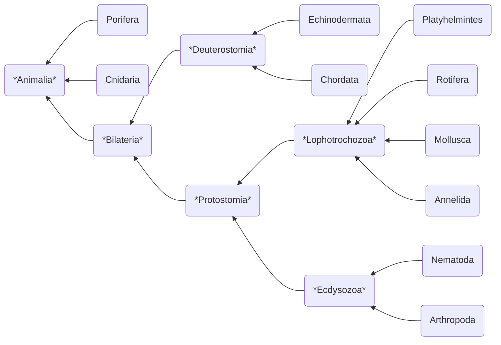

---
tags:
  - bio/eco
  - cegep/3
date: 2025-09-25T17:28:49
---

# Animalia

Kingdom of [[Eukarya]]

- Heterotroph
- Diploid
	- Gametic meiosis -> small flagellated sperm & large non-motile egg
- Evolved from the Cambrian explosion

## Classification

| Phylum         | Symmetry    | [[Tissue]]   | [[Coelom]] | Stomia       | C.D.S. |
| -------------- | ----------- | ------------ | ---------- | ------------ | ------ |
| Porifera       | No          | *No tissue*  | -          | -            | -      |
| Cnidaria       | Rad.        | *Diploblast* | -          | -            | No     |
| Echinodermata  | Bi. -> Rad. | Triploblast  | Yes        | Deuterostome | Yes    |
| Chordata       | Bi.         | Triploblast  | Yes        | Deuterostome | Yes    |
| Platyhelmintes | Bi.         | Triploblast  | *No*       | Protostome   | *No*   |
| Rotifera       | Bi.         | Triploblast  | *Pseudo*   | Protostome   | Yes    |
| Mollusca       | Bi.         | Triploblast  | Yes        | Protostome   | Yes    |
| Annelida       | Bi.         | Triploblast  | Yes        | Protostome   | Yes    |
| Nematoda       | Bi.         | Triploblast  | *Pseudo*   | Protostome   | Yes    |
| Arthropoda     | Bi.         | Triploblast  | Yes        | Protostome   | Yes    |

### Clades

#### Bilateria

- Bilateral symmetry

#### Deuterostomia

Deuterostome

- *Radial* and *indeterminate* eight-cell stage
- Coelom formed from *folds of archenteron* 
- Blastopore develops into *anus*

#### Protostomia

Protostome

- *Spiral* and *determinate* eight-cell stage
- Coelom formed from *split circular mesoderm*
- Blastopore develops into *mouth*

#### Lophotrochozoa

  - Two stages:
	  - **Trochophore**: larva
	  - **Lophophore**: adult
  - Ciliated

#### Ecdysozoa

- **Ecdysis**: growth by moulting (shedding) the cuticle or exoskeleton

### Phyla

#### Porifera

Sponge

  - *Lightweight*
  - No tissues nor organs
  - **Spicule**: crystalline endoskeleton
  - Consists of 3 layers of cells:
	- Outer: epidermal cells
	- Middle: amoeboid cells
	- Inner: flagellated cells (**choanocyte**)

#### Cnidaria

- *Heavyweight*
- **Cnidocyte**: stinging cell
	- **Nematocyst**: capsule containing the irritant
- Two body types:
	- **Polyp**: largely *stationary*, *upwards* oral side (tentacles)
	- **Medusa**: *floating*, *downwards* oral side (tentacles)
- Members:
	- Jellyfish: predominantly medusa
	- Obelia: alternating between polyp and medusa
	- Coral: polyp only
	- Sea anemone: polyp only

#### Echinodermata

- `E.g.` starfish, sea urchin, sea cucumber
- **Water vascular system** for locomotion and grabbing food
	- **Madreporite** acts as the pressure-equalizing valve.
	- **Tube feet** sticks onto substrate with adhesive chemicals.
- No mouth; **cardiac stomach** inverts to unleash digestive enzyme on preys, then regurgitates

#### Chordata

Cordate

#### Platyhelminthes

Flatworm

- ==Exceptionally doesn't have two stages==
- Can regenerate from a body fragment
- Members:
	- **Planarian**: *free*
	- **Fluke**: *parasitic*
	- **Tapeworm**: *parasitic*

#### Rotifera

Wheel animal

#### Mollusca

Softbody

- Visceral mass
- Muscular feet
- Open circulatory system (except cephalopoda)
- Groups:
	- **Snail**: snail, slug
	- **Bivalve**: clam, oyster
	- **Cephalopoda**: octopus, squid
		- Intelligent
		- **Chromatophore**: specialized cell that allows for camouflage

#### Annelida

Segmented worm

- Groups:
	- **Leech**: *freshwater*
	- **Earthworm**: *soil*
	- **Sandworm**: *marine*
		- **Parapodia**: protrusions from the body for gas exchange

#### Nematoda

Roundworm

- Smooth cuticle
- Many are parasites

#### Arthropoda

- [[polysaccharide#Chitin|Chitin]] exoskeleton
- Segmented body
- Jointed leg
- Groups:
	- Crustaceans
	- Centipedes
	- Spiders
	- Insects
		- **Compound eye**: better at detecting motion
		- **Metamorphosis**: Transformation to next stage of development
		- Excretory system:
			- **Malpighian tubule** allows for reabsorption of water, ions and organic molecules.
		- Respiratory system:
			- **Spiracle** <-> **tracheal tube** <-> **tracheole** <-> body cell