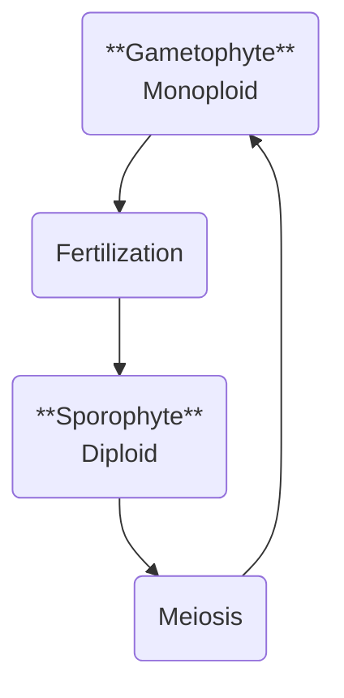

---
tags:
  - eco
  - cegep/3
date: 2025-08-19T16:09:26
---

# Buffer

- test sep 30
- lab test nov 20
- 4 units
	- 1 evolution
	- 1.6 biodiversity
	- 2 ecology
	- 3 human factor

# plant cycle

# foodchain

> [!abstract] trophic cascade
> Phenomenon where decrease / increase of a population leads to alternating increase / decrease of adjacent populations