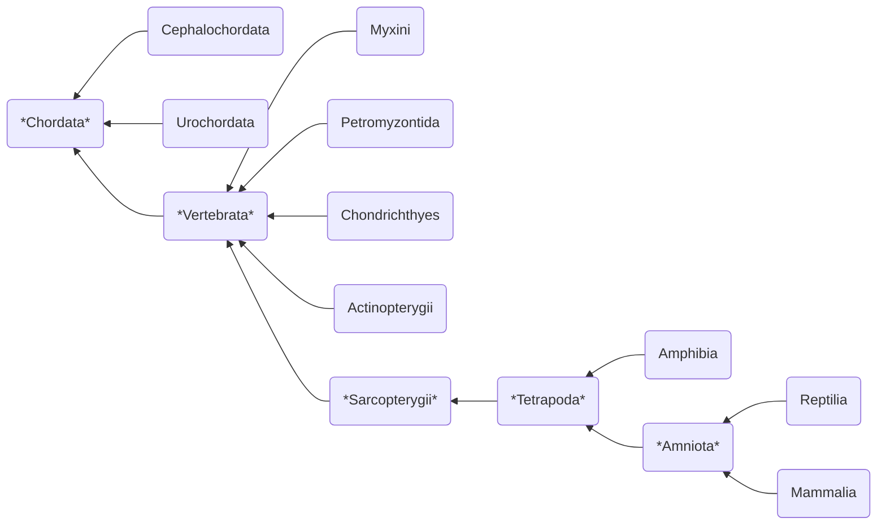

---
tags:
  - bio/eco
  - cegep/3
date: 2025-10-14T16:15:44
---

# Chordata

Phylum of [[Animalia#Deuterostomia]]

Common features (not necessarily present in adult form) :

- **Notochord** for support
- **Dorsal nerve cord** (spinal cord in humans) for nervous system
- **Pharyngeal slits** for filter feeding
- Muscular post-anal tail for swimming

## Classification

| Class           | Vertebrae | Jaws, mineralized skeleton | Lungs | Lobed fins, limbs with digits | Amniotic egg | Milk |
| --------------- | --------- | -------------------------- | ----- | ----------------------------- | ------------ | ---- |
| Cephalochordata | No        | No                         | No    | No                            | No           | No   |
| Urochordata     | No        | No                         | No    | No                            | No           | No   |
| Myxini          | Yes       | No                         | No    | No                            | No           | No   |
| Petromyzontida  | Yes       | No                         | No    | No                            | No           | No   |
| Chondrichthyes  | Yes       | Yes                        | No    | No                            | No           | No   |
| Actinopterygii  | Yes       | Yes                        | Yes   | No                            | No           | No   |
| Amphibia        | Yes       | Yes                        | Yes   | Yes                           | No           | No   |
| Reptilia        | Yes       | Yes                        | Yes   | Yes                           | Yes          | No   |
| Mammalia        | Yes       | Yes                        | Yes   | Yes                           | Yes          | Yes  |

### Clades

#### Vertebrata

Vertebrate
`Ant.` invertebrate

- Endoskeleton
	- **Vertebrae**: bone around the spinal cord ==derived from notochord==
- Circulatory system:
	- **Countercurrent**:
	- Single circulation
	- Double circulation amphibian
	- Double circulation mammal

#### Sarcopterygii

Lobe-finned fish

#### Tetrapoda

Tetrapod

- **Limbs with digits** evolved from fins of lobe-finned fish

#### Amniota

Amniote

- **Amniotic egg**

### Classes

#### Cephalochordata

Lancelet

- Filter feeder

#### Urochordata

Tunicate

- Filter feeder

#### Myxini

Hagfish

- Predator and scavenger
- Cartilaginous (rudimentary) vertebrate
- Slime glands for defense

#### Petromyzontida

Lamprey

- Mostly parasitic
- Cartilaginous (rudimentary) vertebrate
- Circular mouth for clamping onto living fish and sucking fluid
- Circular rows of teeth for scraping the host  

#### Chondrichthyes

Cartilaginous fish

- **Jaw** for efficient hunting and food processing
- **Fins** for precise movement
- Cartilaginous skeleton for quick movement
- Members: shark, ray

#### Actinopterygii

Ray-finned fish

- ==Fine rays of bone supporting the fins==
- Bone primarily made of calcium and phosphorus minerals
	- Greater support
	- Mineral storage
- Contains most fish species

#### Amphibia

Frog, salamander

- Most have an ==aquatic larval form== and a ==terrestrial adult form==.

#### Reptilia

Reptile

- **Eggshell** surrounding the amniotic egg to prevent the embryo from drying out
- Groups:
	- Non-avian reptiles
		- *Leathery* eggshell
	- Birds
		- *Calcareous* eggshell

#### Mammalia

Mammal

- ==Embryo development inside mother==
- No eggshell
- **Mammary glands** to produce milk