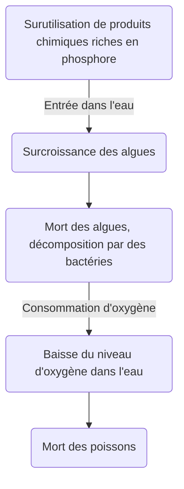

---
tags:
  - chem/environment
  - sec/4
---

# Eutrophisation

```mermaid
graph
A -->|Entrée dans l'eau| B --> C
C -->|Consommation d'oxygène| D --> E

A(Surutilisation de produits chimiques riches en phosphore)
B(Surcroissance des algues)
C(Mort des algues, décomposition par des bactéries)
D(Baisse du niveau d'oxygène dans l'eau)
E(Mort des poissons)
```