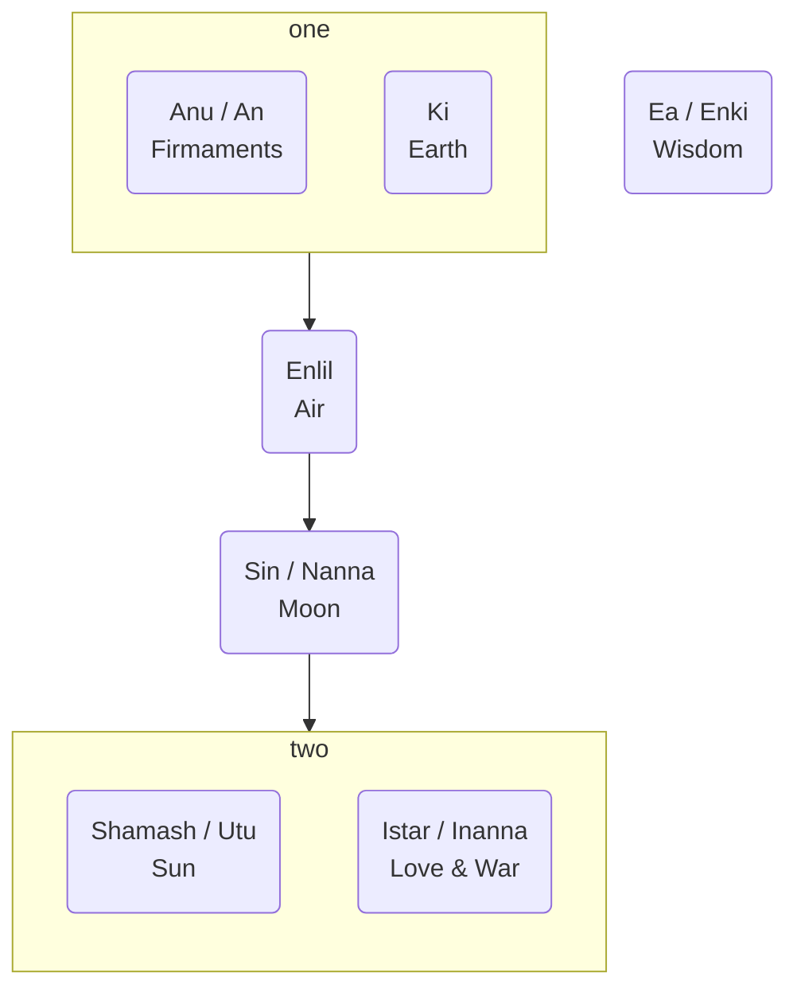

---
tags:
  - en
  - cegep/3
date: 2025-08-20T10:10:55
---

# Buffer

- Last assessment:
	- Either essay or original myth
	- 30% work & 10% presentation
- B-215
- Monday 8-10
- Tuesday 10-11:30

# theme

Insight

# Gilgamesh

Might be the first major piece of literature
Incomplete
Reconstruction from different versions

## Themes

### Sexism

Shamhat (the harlot):

- Nameless in the translated version => diminutive
- "Child of pleasure" => diminutive
- Only exists for a specific purpose, no free will

### Sex

Reserved for the wise <= Enkidu gains wisdom through sex

### Wisdom

A blessing and a curse

- <= Enkidu loses his strength when he gains wisdom
- <= Enkidu curses the trapper and Shamhat for exposing him to wisdom

### Fate

- No free will <= foreshadowing dreams

## Characters

### Gilgamesh

King of Uruk
Two thirds god
Might be a real historical figure

- Arrogant
- Rules with cruelty
- Lustful <= sleeps with all brides

### Enkidu

Wild and lives among the Shepherds
Hairy
Created equal to Gilgamesh
Friend, advisor or servant of Gilgamesh

### Humbaba

Guardian of the cedar forest
Dragon's fangs, lion, flood
Created by Enlil
Born of the mountain
Possesses 7 
Alter ego of Gilgamesh?

## Locations

### Cedar forest

Ambiguous

- Divine <= dwelling of the gods
- Beautiful