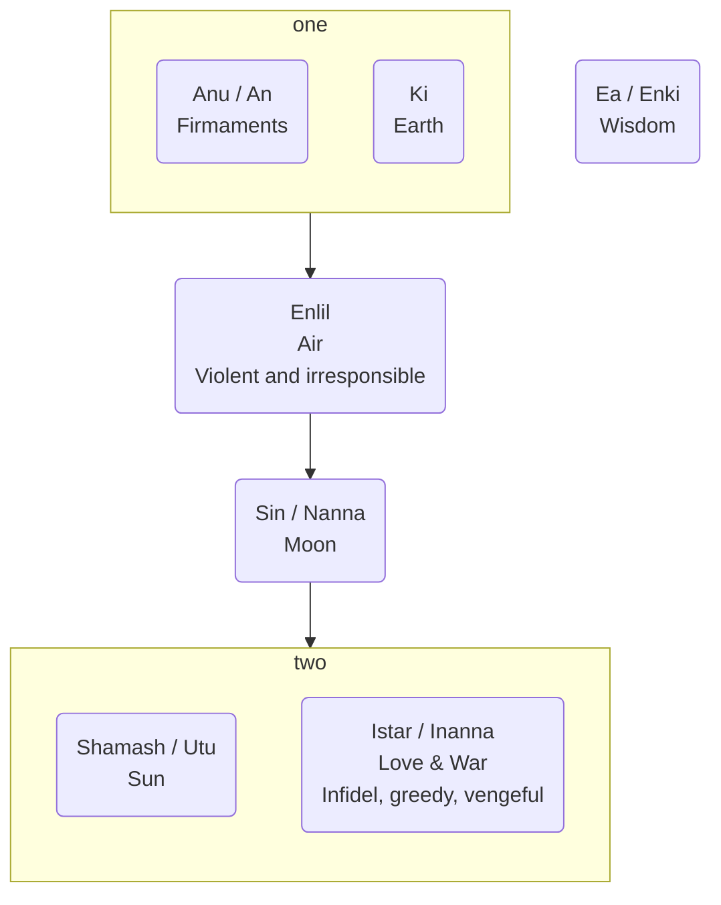

---
tags:
  - en
  - cegep/3
date: 2025-09-02T09:10:20
---

# Gilgamesh

Might be the first major piece of literature
Incomplete
Reconstruction from different versions

## Themes

### Sexism

Shamhat (the harlot):

- Nameless in the translated version => diminutive
- "Child of pleasure" => diminutive
- Only exists for a specific purpose, no free will

### Sex

Reserved for the wise <= Enkidu gains wisdom through sex.

### Wisdom

A blessing and a curse

- <= Enkidu loses his strength when he gains wisdom.
- <= Enkidu curses the trapper and Shamhat for exposing him to wisdom, then he blesses Shamhat for introducing him to Gilgamesh.

### Fate

- No free will
	- <= foreshadowing dreams
	- <= unbreakable curses
- Fate chosen by the Anunnaki (judges) and Mammetun (mother of destinies)

### Death

- Everyone is equal in death.
	- => the powerful fear death more because they will lose their power.
- When one becomes aware of death, one wants to prove their worth and be remembered by everyone.

## Characters

### Gods

- Easily persuaded
- Corrupt

### Gilgamesh

King of Uruk
Two thirds god
Might be a real historical figure

- Arrogant
- Rules with cruelty
- Lustful <= sleeps with all brides

### Enkidu

Wild and lives among the Shepherds
Hairy
Created equal to Gilgamesh
Friend, advisor or servant of Gilgamesh

- Loyal

### Humbaba

Guardian of the cedar forest
Dragon's fangs, lion, flood
Created by Enlil
Born of the mountain
Possesses 7 treasures
Alter ego of Gilgamesh?

### Utnapishtim

Father of Gilgamesh
Only man to whom the gods gave everlasting life
Lives in the land of Dilmun, in the garden of the sun

## Locations

### Cedar forest

Ambiguous

- Divine <= dwelling of the gods
- Beautiful

### Mashu

Great mountains that guard the rising and the setting sun
Guarded by Scorpions