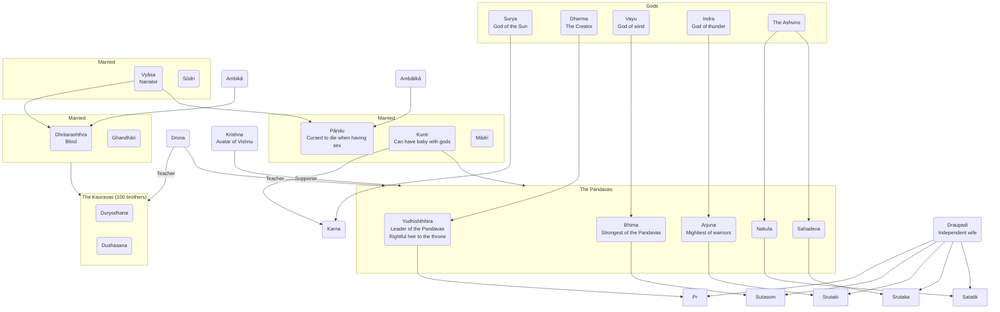

---
tags:
  - Humanities
  - cegep/1
date: 2024-08-27T14:25:23
---

# Mahabharata

One of the two sacred epics in [[Hinduism]]
`Lit.` "great story of the Bharatas" or "great story of Indian tribe"

Longest epic in world literature
Resembles a long journey with many side stories

> [!quote] "Whatever here is found elsewhere. But whatever is not here is nowhere else."

## Worldview aspects

- Relationships, roles, obligations, loyalties
	- Family
		- Draupadi staying loyal by not taking off her clothes
		- Ghandâri blindfolding herself to not be superior to her husband
	- Teacher, student
		- Ekalavya, being absolutely obedient to Drona, cuts off his thumb.
- Morality, ethics, righteousness
	- Generosity
		- The Pandavas must share Draupadi among them.
	- Modesty
		- Draupadi refusing additional wishes granted to her
- Conundrums
	- Family loyalty and duty take precedence over righteousness.
		- The Pandavas accepting to be played by Yudhishthhira
	- Also righteousness takes precedence over family loyalty and duty.
		- The Pandavas fighting their family and friends
		- Krishna convincing Arjuna that fighting his family and friends is justified

## Characters

## Gita

Particularly sacred section in Mahabharata
Conversation between Vishnu as Krishna and warrior Arjuna
Arjuna has crisis because he must fight people he loves and respects

## Resume

Ghandâri realises her husband is blind and, not wanting to be above her husband in physical abilities, blindfolds herself forever. When she hears Pandu had a son who will inherit the throne, she forcefully gives birth to a metallic ball which turned into 100 sons. Pandu embraces his fate of dying while holding Mâdri in his arms. Mâdri suicides.

20 years later, Drona trains Arjuna to be the best warrior. He refuses Ekalavya to be his pupil and makes him cut off his right thumb. Duryodhana names Karna king. The Pandavas share Draupadi as wife. Duryodhana challenges Yudhishthhira, but makes his uncle play instead. Yudhishthhira loses everything. His wife becomes servant. They try to take off her clothes, but failed because she wears innumerable layers of cloth. They grant her favours, and she chooses to free her husbands. Yudhishthhira loses one final bet and is exiled for 12 years.

12 years after, the Kauravas and the Pandavas fight again in a battle involving all kingdoms. Arjuna is afraid to fight his relatives, but Krishna convinced him in a speech known as [[#Gita]].
