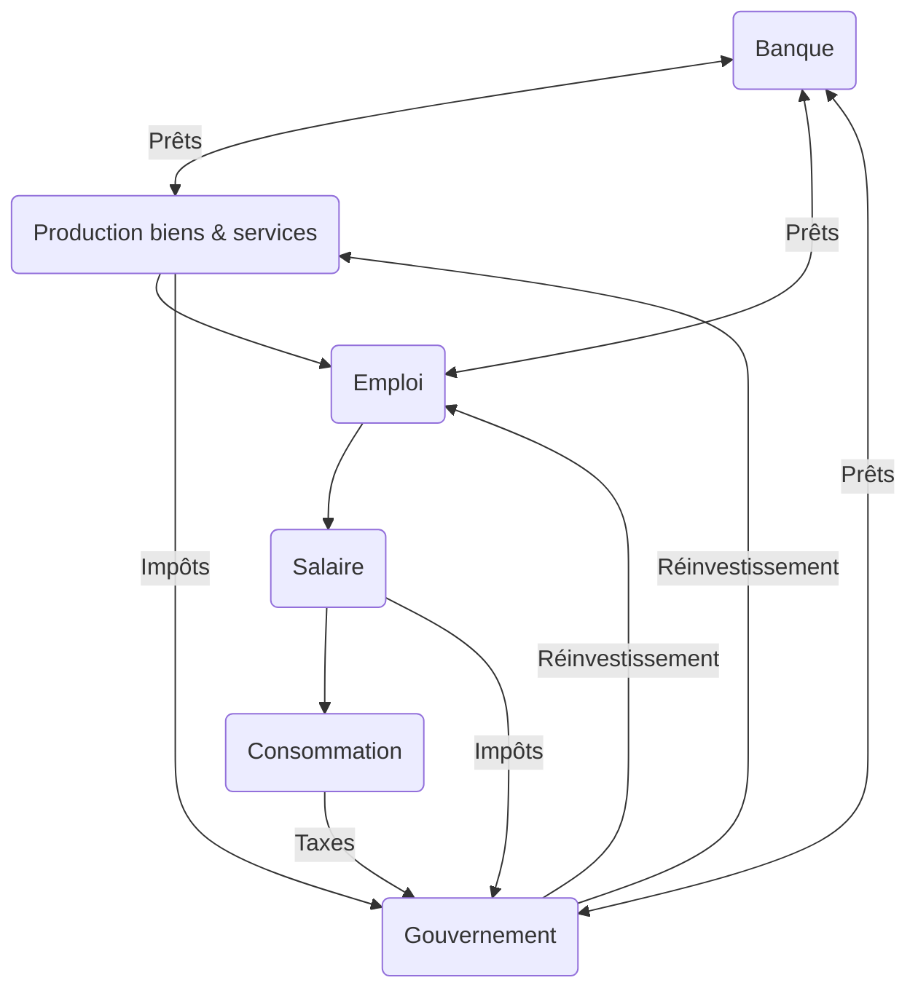

---
tags:
  - Finance
  - Sec/5
date: 2023-11-06 22:48
---

# Capitalisme

```mermaid
graph
A(Production biens & services) --> B(Emploi) --> C(Salaire) --> D(Consommation) -->|Taxes| E(Gouvernement) -->|Réinvestissement| A
A -->|Impôts| E
C -->|Impôts| E
E -->|Réinvestissement| B
F(Banque) <-->|Prêts| A
F <-->|Prêts| B
F <-->|Prêts| E
```