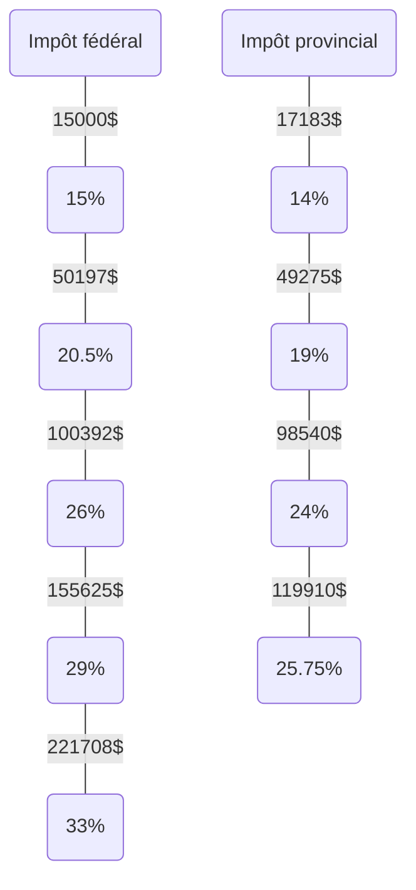
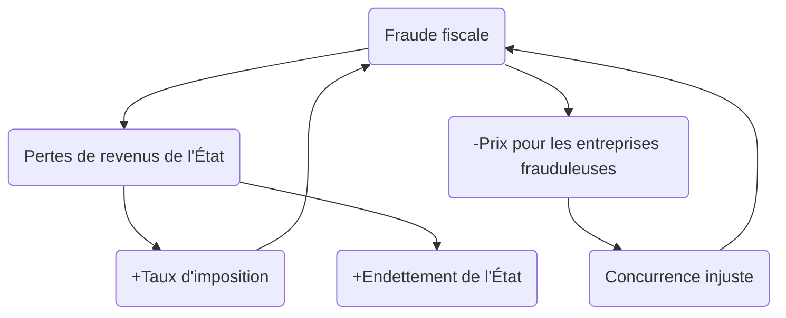

---
tags:
  - fin
  - sec/5
date: 2023-11-06 22:49
---

# Fiscalité

Ensemble des règles, des lois et des pratiques concernant la perception des [[impôt|impôts]], des [[taxe|taxes]] et des autres prélèvements obligatoires.

## Prélèvements

### Impôts au Canada et au Québec (2023)

### Déductions au salaire

~7% du salaire

- [[assurance-emploi|Assurance-emploi]] (AE)
- Régime québécois d’assurance parentale (RQAP)
- Régime de rentes du Québec (RRQ) (<3500$)

### Taxes

Fédéral : 5%
Provincial : 9.975%

## Types de réduction fiscale

Pour payer moins d'impôts et de taxes...

### Planification fiscale

Utilise des moyens légaux.

> [!example]+
> - Crédits d'impôt
> - Comptes REER, CELI, etc.
> - Reçus pour dons de charité

### Évasion (fraude) fiscale

Utilise des moyens illégaux. Toute insuffisance, omission ou inexactitude dans la déclaration de revenus constituent une fraude fiscale.

> [!example]+
> - Travail au noir dont le salaire n'est pas déclaré
> - Marché noir où sont vendus des produits illicites sans impôts ni taxes
> - Vente sans facture, donc sans taxes

### Évitement fiscal

Utilise des moyens légaux ou dans la zone grise de la loi, mais ne respecte pas l'objectif ou l'esprit de la loi.

> [!example]+
> - Paradis fiscaux
> - Sociétés écrans
