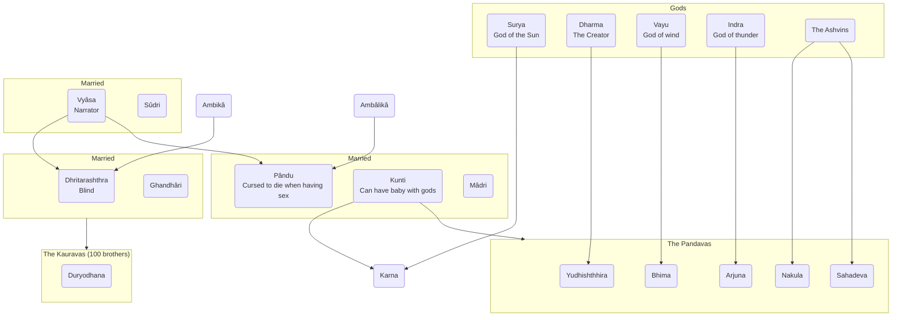

---
tags:
  - Cegep1
  - Humanities
date: 2024-08-27T14:25:23
---

# Mahabharata

One of the two sacred epics in [[Hinduism]]
`Lit.` "great story of the Bharatas" or "great story of Indian tribe"

Longest epic in world literature
Resembles a long journey with many side stories

> [!quote] "Whatever here is found elsewhere. But whatever is not here is nowhere else."

## Characters

## Gita

Particularly sacred section in Mahabharata
Conversation between Vishnu as Krishna and warrior Arjuna
Arjuna has crisis because he must fight people he loves and respects

## [[Worldview]] aspects

- Family relationships, roles, obligations, loyalties
	- Father, mother, son, daughter, husband, wife
- Caste
- Teacher-student relationship
	- Respect, deference, absolute obedience
- Gender constructs, norms
	- Man, woman
- Morality, ethics, righteousness
- Conundrums (conflicts of kinship and friendship)
	- Family loyalty and duty take precedence over righteousness.
	- Also righteousness takes precedence over family loyalty and duty.
