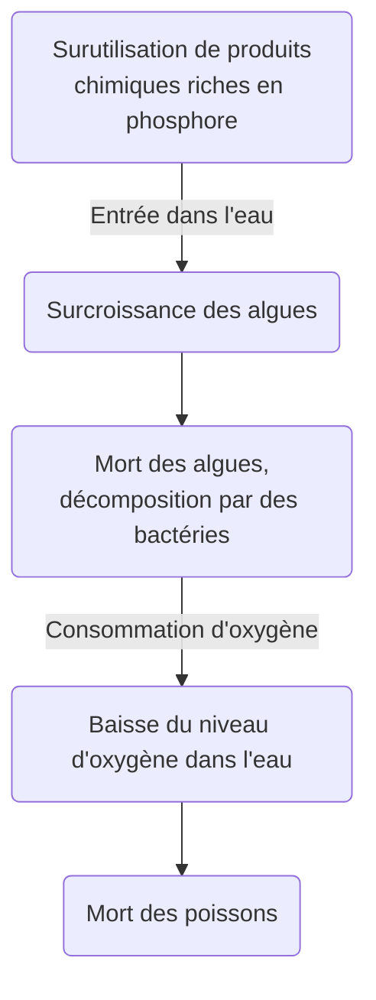

---
tags:
  - Sec4
  - SCI
---

## Eutrophisation

```mermaid
graph
A -->|Entrée dans l'eau| B --> C
C -->|Consommation d'oxygène| D --> E

A(Surutilisation de produits\nchimiques riches en phosphore)
B(Surcroissance des algues)
C(Mort des algues,\ndécomposition par des bactéries)
D(Baisse du niveau d'oxygène dans l'eau)
E(Mort des poissons)
```